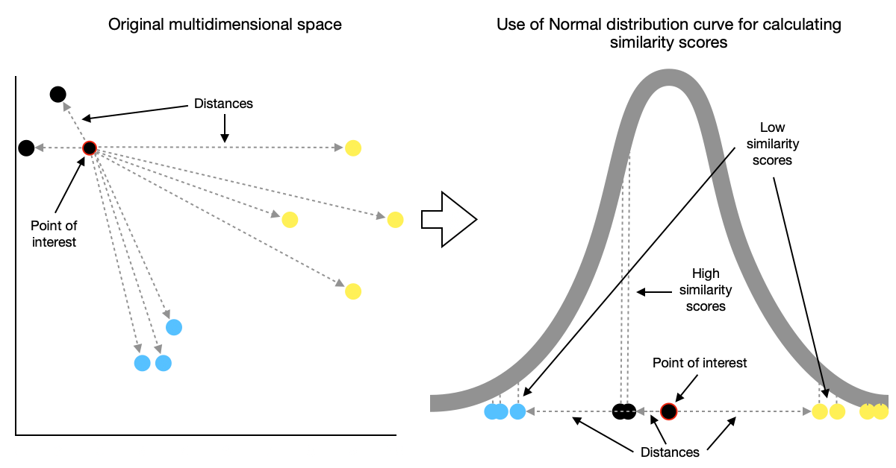

##### Word to Vec 
Word to Vec è un insieme di modelli utilizzati per produrre word embedding. Il word embedding è un modo per rappresentare delle parole tramite dei vettori. Uno dei metodi più semplici è quello di creare un vettore di dimensione pari al numero di parole presenti nel dataset dove 1 corrisponde alla parola. Questo metodo è chiamato One-Hot encoding.  
|  | 1 | 2 | 3 | 4 | 5 | 6 | 7 | 8 | 9 | 
|:-----|:--------:|:--------:|:--------:|:--------:|:--------:|:--------:|:--------:|:--------:|------:| 
| Uomo | 1 | 0 | 0 | 0 | 0 | 0 | 0 | 0 | 0 | 
| Donna | 0 | 1 | 0 | 0 | 0 | 0 | 0 | 0 | 0 |  
| Ragazzo | 0 | 0 | 1 | 0 | 0 | 0 | 0 | 0 | 0 | 
| Ragazza | 0 | 0 | 0 | 1 | 0 | 0 | 0 | 0 | 0 | 
| Principe | 0 | 0 | 0 | 0 | 1 | 0 | 0 | 0 | 0 | 
| Principessa | 0 | 0 | 0 | 0 | 0 | 1 | 0 | 0 | 0 | 
| Regina | 0 | 0 | 0 | 0 | 0 | 0 | 1 | 0 | 0 | 
| Re | 0 | 0 | 0 | 0 | 0 | 0 | 0 | 1 | 0 | 
| Monarca | 0 | 0 | 0 | 0 | 0 | 0 | 0 | 0 | 1 | 

Non ho scelto questo modello perché non ti permette di considerare il contesto, nel caso di Fish to Vec i vari valori. Quindi ho optato per un modello personalizzato dove ogni valore corrisponde ad uno dei miei valori.
|  | Femminilità | Giovane | Reale |
|:-----|:--------:|:--------:|------:| 
| Uomo | 0 | 0 | 0 |
| Donna | 1 | 0 | 0 |
| Ragazzo | 0 | 1 | 0 |
| Ragazza | 1 | 1 | 0 | 
| Principe | 0 | 1 | 1 | 
| Principessa | 1 | 0 | 1 | 
| Regina | 1 | 1 | 1 |
| Re | 0 | 0 | 1 | 
| Monarca | 0.5 | 0.5 | 1 | 

Per visualizzare i nostri embedding possiamo usare uno scatter plot dove ogni valore nell'embedding rappresenta un asse. Se lavoriamo su embedding con più valori come Word to Vec che sono 200 dobbiamo trovare un un modo per mostrare i nostri dati su un piano tridimensionale o bidimensionale.

##### Tecniche di riduzione di dimensionalità
Le tecniche di riduzione di dimensionalità servono per passare da dati con uno spazio ad alta dimesione ad uno più piccolo mantenendo la maggior parte delle informazioni. Quando si passa da una dimensione ad un altra viene definito come mapping. Esistono molte tecniche di riduzione di dimensionalità:
- Analisi delle componenti principali (PCA): La tecnica consiste in un mapping lineare dei dati non supervisionato;
- T-distributed Stochastic Neighbor Embedding (T-SNE): E' una tecnica non lineare e non supervisionata.
Nel mio caso ho scelto la tecnica T-SNE che spiegherò la motivazione nella sezione di analisi del dataset.

## T-SNE (T-distributed Stochastic Neighbor Embedding)
L'obiettivo principale di T-SNE è quello di preservare le relazioni di similarità tra i dati originali durante la proiezione in uno spazio di dimensioni inferiori. La tecnica si basa su due concetti chiave: la misura di similarità tra coppie di punti e la distribuzione delle probabilità di punti nello spazio originale e nello spazio ridotto.

##### Unsupervised Nearest Neighbors
L'algoritmo Unsupervised Nearest Neighbors (NN) è un metodo di apprendimento non supervisionato utilizzato per la ricerca di vicinato in un insieme di dati. L'obiettivo principale dell'algoritmo Unsupervised NN è quello di individuare i punti di dati simili o vicini in base alla loro somiglianza strutturale. Questo viene fatto calcolando la distanza tra i punti di dati utilizzando una metrica appropriata, come la distanza euclidea o la distanza di Manhattan.

Adesso che abbiamo visto quali algoritmi sono stati usati possiamo vedere come è fatta la prima parte del progetto: [[L'acquisizione dei dati]]